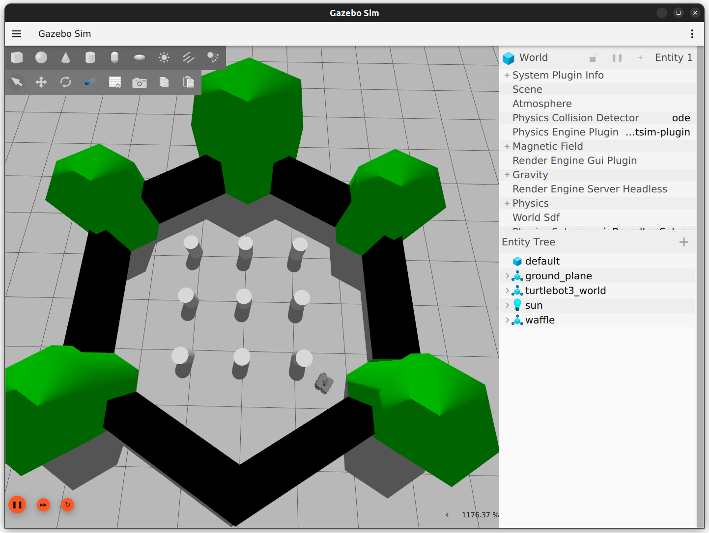

# SMC Plugins for ROS 2 and Gazebo

In this repository, we show how it is possible to use Statistical Model Checking (SMC) plugins to verify a robotic system that is partly implemented using ROS 2 and Gazebo.
This repository is connected to the article "Integrating External Components in JANI Models Using SMC Plugins".
Please find the up-to-date content of this repository at <https://github.com/convince-project/smc_ros_gazebo_plugins> .
This content is available on Zenodo: <https://doi.org/10.5281/zenodo.17359747> .

## Repository content

The repository consists of the following packages:

* *gz_sim_handler*: containing the JANI models used for verification, as well and the launch files used to start the experiments and the spawn_simulation_ros script, used to handle creation and deletion of the complete simulation environment (based on requests coming from the SMC plugins) and additional elements describing the simulation environment;
* *sim_handling_interfaces*: containing the ROS interfaces used for the communication between the SMC plugins and the spawn_simulation_ros script;
* *gazebo_smc_plugins*: containing the implementation of the SMC plugins used for experiments 1 and 2;
* *ros_smc_plugins*: containing the implementation of the SMC plugins interfacing with the roamer server, used for experiment 3;
* *roamer_pkg*: containing the roamer server, that drives the simulated robot upon request

## Updates for fixing problems reported by the reviewers

### Problem 1: Building the docker image results in a large memory usage, resulting in the OS crashing
*Fix:*
We updated the Docker recipe to limit the amount of parallel threads used to compile both the packages we depend on and our ones.
This limits the amount of required memory.

### Problem 2: Problem when starting the container for running the experiment
*Error message:*
Error response from daemon: failed to create task for container:
failed to create shim task: OCI runtime create failed: runc create failed:
unable to start container process: error during container init: error
running prestart hook #0: exit status 1, stdout: , stderr: Auto-detected mode as 'legacy'
nvidia-container-cli: initialization error: load library failed: libnvidia-ml.so.1: cannot open shared object file: no such file or directory: unknown
*Fix:*
We did not manage to reproduce the issue, but it seems to be related to the setup of the reviewer's machine. The same issue was reported here: https://github.com/NVIDIA/nvidia-container-toolkit/issues/305
From what we can see, those are the possible root causes of the issue:
* Wrong docker package installed (installing `docker.io` instead of `docker-ce`)
* Docker installation requiring reinstallation: `sudo apt-get install --reinstall docker-ce`
* Nvidia-drivers requiring to be reinstalled (you can use `sudo ubuntu-drivers install` and select nvidia-driver-535, making sure to pick the proprietary ones, not the open ones)

## Pre-requisites

To run the examples in this artifact, the platform needs to satisfy the following pre-requisites:

* It runs on Ubuntu (22.04 or higher)
* An NVidia-GPU is available, and related drivers are installed
* Docker is available, with the additional nvidia-container-toolkit

### Verify system compatibility

To test the correct configuration of the GPU, it is possible to use NVidia SMI.
Run:

```bash
nvidia-smi
```

and check if it can detect a graphic card. If not, the Nvidia drivers are not working correctly, and the experiments won't be able to run.

To check if the nvidia-container-toolkit is installed, run:

```bash
nvidia-container-toolkit -version
```

and check if the system can find it. If not, you can use [this guide](https://docs.nvidia.com/datacenter/cloud-native/container-toolkit/latest/install-guide.html) for installing it.

## Installation

To ensure reproducibility, we recommend using the provided Docker setup, using the Ubuntu 24.04 image and ROS jazzy.

The docker image that we are going to build will contain:

* ROS 2 Jazzy
* ROS Gazebo
* SMC Storm
* Different SMC Plugins, used to communicate with Gazebo and control a wheeled robot

The docker image can be built using docker compose.
To do that, go to the main package folder, containing the `docker_compose.yaml` file, and run:

```bash
docker compose build --pull base_container
```

Depending on your network and your computer, the first time this step could take around one hour.

## Running the experiments

### Start the docker container

The docker container can be started using docker compose, using the command:

```bash
docker compose run --rm experiment_<one/two/three>
```

This command will start the simulation, and open a new `xterm` terminal, that can be used to visualize the status of verification on the SMC tool (smc_storm).

Due to limitations from the robot simulation engine, experiments shall be executed independently: please do not try to execute multiple experiments in parallel!

Each experiments takes roughly 20 minutes, 14 GB of RAM and a large part of your CPU (with an Intel i7-11850H with 16 threads, it takes around 70% CPU).

### Run the experiments

The subsections below provide with the exact command to run the experiments. Each experiment launches the SMC tool (smc_storm) together with the `spawn_simulation_ros.py` python node, that will create and destroy the robot simulation outside of the SMC tool based on request (each time the SMC tool starts a trace, a new simulation is created, and once it finishes, it is destroyed).
The experiment command starts the SMC tool in a separated XTerm session, to better separate the different output from the different running processes.

Details on the configuration of each tool for each experiment can be found in the [configuration files folder](gz_sim_handler/config/).

Additional commands for visualization and plotting are presented in the sections after the experiments.

### Quick test before running the complete experiments

We provide a shorter version of experiment 1, to test whether everything works as expected.
It can be executed using:

```bash
docker compose run --rm experiment_quick
```

Check whether the result from the SMC tool is similar to the following one:

```
============= SMC Results =============
        N. of times target reached:     4
        N. of times no termination:     1
        Tot. n. of tries (samples):     8
        Estimated success prob.:        0.5714285714
        Confidence score: 0.95
        Estimated Epsilon: 0.339773 (Corrected Wilson Method)

        Min trace length:       0
        Max trace length:       975
=========================================
Result: 0.5714285714
```

In particular, make sure that the amount of traces with no termination (errors) is low (up to 2, due to possible issues at startup).
Given the low number of samples, the "Result" value at the end can be anything between 0.0 and 1.0.

As soon as the results are ready, it is possible to close the xterm terminal and proceed with the complete experiments.

This small test should take one minute.

### Experiment 1: Basic controller (obstacle-avoidance)

For the first and the second experiment, we rely on the statistical model checker to control the simulation completely: this means that the simulation is normally paused, and it steps forward by a specific amount of time only after this is requested by the model checker.

This experiments uses the SMC plugins developed in the [gazebo_smc_plugins package](gazebo_smc_plugins) and the [basic_controller_model.jani model](gz_sim_handler/jani/basic_controller_model.jani).

This image gives an overview of the model.


The red arrows are related to edges associated to an SMC Plugin, while the other edges are implemented directly in JANI.
The model does the following operation:

* Update the model status, asking the simulator (Gazebo) to advance by one step and reading the updated information
* Check if the robot has an obstacle on its front, front-left or front-right side:
  * If yes, prepare a rotational-only motion (to spin the robot until no obstacle is in front anymore)
  * If not, compute the new velocity to drive the robot towards the goal position
* Finally, send the velocity to the simulator, and go to the first operation again.

To start the first experiment, run the following:

```bash
docker compose run --rm experiment_one
```

This command will run the experiment on 4 parallel threads, *and will take ~ 20 minutes* to generate a result based on 400 traces (limited in the configuration for execution time reasons).

In XTerm, SMC Storm will provide information on the current status of the experiment, reporting on the right side how many traces satisfied the property (*S*uccess), how many did not satisfy the property (*F*ailure) and how many failed to terminate correctly (*U*nknown).
The percentage value relates to how the chosen statistical method is converging to the desired result (by default, we are using the Adaptive Sampling Method, with an 95% Confidence Score and an Epsilon of 0.01).

Below, an exemplary progress bar from SMC Storm, after generating 128 traces:

```
[--------------------------------------------------] 0%  (S: 88 F: 40 U: 0)     
```

Once finished, the XTerm terminal running smc_storm should report a result similar to the following one:

```
============= SMC Results =============
        N. of times target reached:     271
        N. of times no termination:     1
        Tot. n. of tries (samples):     400
        Estimated success prob.:        0.679197995
        Confidence score: 0.95
        Estimated Epsilon: 0.0468555 (Corrected Wilson Method)

        Min trace length:       0
        Max trace length:       982
=========================================
Result: 0.679197995
```

At this point, the XTerm terminal can be closed, and the experiment is finished.

### Experiment 2: Controller with refined recovery (obstacle-avoidance)

This model is a small refinement of the one from the 1st experiment, with a more refined handling of the case with obstacles in front of the robot.

It relies on the same plugins used in the previous experiment.
The only difference lies on the handling of the obstacles in front of the robot: the robot starts spinning only in case the front side detects an obstacle (ignoring the front-left and front-right side), and once it starts, it keeps rotating until all three sides are free.

The JANI model containing the refined model can be found in [refined_controller_model.jani](gz_sim_handler/jani/refined_controller_model.jani). As for the previous model, it makes use of the SMC plugins provided in the [gazebo_smc_plugins package](gazebo_smc_plugins).

To start the second experiment, run the following:

```bash
docker compose run --rm experiment_two
```

This command will run the experiment on 4 parallel threads, *and will take ~ 20 minutes* to generate a result based on 400 traces (limited in the configuration for execution time reasons).

Once finished, the XTerm terminal running smc_storm should report a result similar to the following one:

```
============= SMC Results =============
        N. of times target reached:     385
        N. of times no termination:     0
        Tot. n. of tries (samples):     400
        Estimated success prob.:        0.9625
        Confidence score: 0.95
        Estimated Epsilon: 0.02028 (Corrected Wilson Method)

        Min trace length:       89
        Max trace length:       926
=========================================
Result: 0.9625
```

At this point, the XTerm terminal can be closed, and the experiment is finished.

### Experiment 3: Random roamer

This model relies on a completely different philosophy, expecting the simulation to be always running, and reading the state from the simulation when the plugin is executed, without the need of pausing/unpausing the simulation each time.

The experiment itself consists of a robot moving randomly in a room until it bumps into an obstacle. Each time it completes a movement, a rotation accompanied by a linear translation, it increases a counter. The movement portion is executed through the assignment of a goal displacement to a ROS action by the plugin. This module returns the conclusion of the movement and whether the robot bumped during it.

The model itself is shown in the following picture.


It relies on the [roamer_model.jani model](gz_sim_handler/jani/roamer_model.jani), that in turns makes use of the SMC plugins provided in the [ros_smc_plugins package](ros_smc_plugins).

To start the third experiment, run the following:

```bash
docker compose run --rm experiment_three
```

This command will run the experiment on 4 parallel threads, *and will take ~ 20 minutes* to generate a result based on 400 traces (limited in the configuration for execution time reasons).

Once finished, the XTerm terminal running smc_storm should report a result similar to the following one:

```
============= SMC Results =============
        N. of times target reached:     120
        N. of times no termination:     7
        Tot. n. of tries (samples):     400
        Estimated success prob.:        0.3053435115
        Confidence score: 0.95
        Estimated Epsilon: 0.0466115 (Corrected Wilson Method)

        Min trace length:       2
        Max trace length:       20
=========================================
Result: 0.3053435115
```

At this point, the XTerm terminal can be closed, and the experiment is finished.

### Optional: visualize the running experiment

Optionally, it is possible to visualize the running simulation using the Gazebo GUI. This can be done while the experiment is running.
To do that, open a new terminal and execute the command:

```bash
docker compose run --rm visualize_sim_<0/1/2/3>
```

selecting between 0, 1, 2 or 3 depending on which of the four thread you want to visualize.

The result will look like in this image:



### Optional: visualize the exported traces

Each trace that is generated during the experiments is exported as an own CSV file. It can be found in the container's `/tmp` folder, and can be inspected either with a normal text editor, or by plotting tools as `plotjuggler` (recommended).

To access the traces, you can access the running container using:

```bash
docker compose exec experiment_<one/two/three> terminator
```

In the new terminal, it is possible to open a trace using plotjuggler with the following command:

```bash
source install/setup.bash
cd /tmp/<traces-folder>
ros2 run plotjuggler plotjuggler -n -d <trace_csv_file>
```

having care to substitute the folder and the trace names in the command.

The trace name is structured as follows: `trace_<thread-id>_<trace-number>_<evaluation-result>.csv`.

Once plotjuggler opens, select "Use row number as X axis" in the "CSV Loader" window, confirm by pressing OK, and load the desired entries in the plot.

*Important note:* there might be a prompt about a new version of plotjuggler being available, that hides behind the "CSV Loader" window and prevents from using it.
In that case, close that "new version" window first, and then continue with the CSV loading configuration.

An exemplary outcome (from the first experiment) is the following:


## Optional: Running the single components by hand

Using the docker compose commands as described in the experiments above, allows us to conveniently start multiple processes at once with a single command.

To get a better overview of the tools, it is possible to start the single processes composing the experiments by hand, we provide instructions on how to run them in the [Manual-instructions.md file](Manual-instructions.md).

## Notes

For this experiments, we always showing SMC plugins running alongside external code and exchanging information using ROS 2.
However, it is possible to develop plugins that are self-contained, do not require information from external processes (e.g. [vel_to_goal_smc_plugin.cpp](gazebo_smc_plugins/src/vel_to_goal_smc_plugin.cpp), in this repository).
In case the JANI model uses only self-contained plugins, then the SMC tool can be used on its own, without requiring additional external processes to run in parallel.

Additional information for developing a SMC plugin can be found at the SMC plugins base repository: <https://github.com/convince-project/smc_verifiable_plugins> .

## ETAPS Artifact Badges

With this work, we are applying for the following ETAPS Artifact Badges:

* Available: We make this work available on Github (<https://github.com/convince-project/smc_ros_gazebo_plugins>) and Zenodo (<https://doi.org/10.5281/zenodo.17359748>)
* Functional: We provide a Docker image and related docker compose scripts for reproducing our results.
* Reusable: This artifact serves as an example for using SMC plugins in JANI models, but it can be applied to different use-cases than the ones in this artifact. The documentation is openly available on GitHub.

## License

ros_gazebo_smc_plugins comes under the Apache-2.0 license, see [LICENSE](LICENSE).
